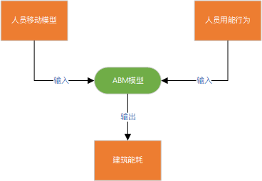
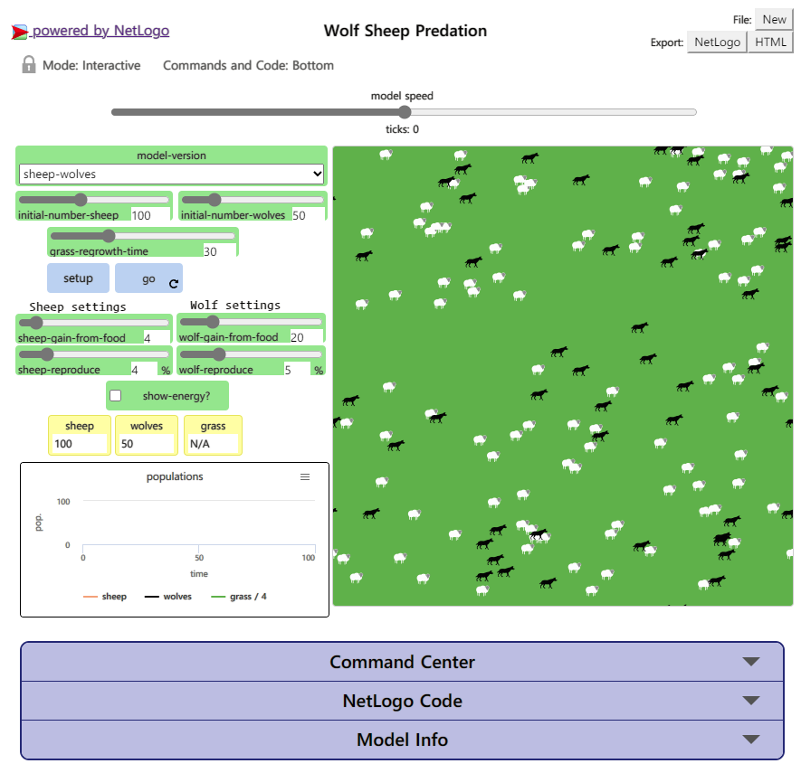

## 相关背景

建筑能耗与人员移动行为和人员用能行为密切相关，为模拟建筑能耗相关信息，需要研究人什么时刻在什么房间（人员移动模型）和人在房间如何使用耗能设备（人员用能行为）

### 人员移动模型

建筑中的人员移动具有四个特点：

* 一定的规律性。人员每天的活动具有一定的规律性
* 一定的随机性。特别在个人建筑空间中，每天的活动不完全相同
* 时间和空间上的自相关性。将建筑以外的环境视为一个名为户外的房间，所有房间的人员总数是固定的，不会凭空产生一个人，也不会凭空消失一个人
* 多人之间的差异性。每个人都有自己的想法，不会只存在一种移动行为

其实上面的特点和生活是息息相关的。一个人每天总是要睡觉、起床和吃饭（规律性）；但是每天还有各种各样的突发事件和计划（随机性）；当你离开一个房间（空间）的时候，你肯定会进入其他房间（空间）（自相关性）；你和其他人之间存在差异，可能你不喜欢动，其他人喜欢四处走动（差异性）

下面介绍各种人员移动模型

#### 固定作息方法

每个人员有一张固定的作息时间表，每个时刻应该在什么地方都进行安排，认为人员会严格执行作息时间表的规划。

**优点：** 实现简单

**缺点：** 没有随机性和差异性

---

#### 随机作息方法

在固定作息方法的基础上考虑了随机性，假设每个房间的人数存在一个分布规律，在固定作息时间表的各时段通过蒙特卡洛法随机产生人数。

**优点：** 实现了随机性，并且简单

**缺点：** 没有自相关性，可能某个时段会突然总人数变多或变少，违背常理

---

#### 时自相关的随机移动方法

考虑自相关的特点，有学者发现办公室人员的行为特征符合某种分布，例如在办公室的时长与不在的时长满足指数分布，上下班和午休满足正态分布。此外还有非齐次的马尔科夫链模拟人员在办公室的变化以及建筑总人数变化。

**优点：** 考虑完善

**缺点：** 相关模型参数依赖长期监测，复杂且成本高

---

#### 基于事件的随机移动方法

前面的方法都是随机的移动，但是人类的移动都是有目的性的，于是通过构造人员的事件模拟真实的移动，利用概率统计和s-curve法预测突发事件发生概率和频率，通过日常规律事件和随机的突发事件就可以模拟实际的事件。

---

### 人员用能行为

家庭能耗的主要组成部分是照明和空调使用，这两种行为主要和环境相关，有学者通过数据分析以及拟合生成了对应的公式模型。

## 基于智能体建模（Agent-Based Modelling，ABM）

这里的智能体（agent）只是对上文中人员的另一种说法，而在建筑能耗模拟领域，基于智能体建模就是推导一个输入人员移动模型和人员用能行为，输出建筑能耗的模型。

在实际建模中还可以考虑政策法规、设备管理和相关技术等影响因素。

## 建模方法和工具

### NetLogo

> **[NetLogo](https://ccl.northwestern.edu/netlogo/ "Netlogo官方网站")** 是一个可编程的建模环境，用于模拟自然和社会现象。特别适合对随时间推移而开发的复杂系统进行建模。建模人员可以向数百或数千个独立操作的“代理”发出指令。这使得探索个体的微观层面行为与从其相互作用中产生的宏观层面模式之间的联系成为可能。

正是因为NetLogo可以向数个agent发出指令，并且让每个个体之间产生联系和相互作用，所以适合模拟现实生活中的场景。例如下面的案例

### 生成事件序列

生成事件序列时，使用固定作息法生成周期性事件（吃饭、睡觉、洗澡），BARABASI优先队列模型生成非周期性事件（外出、娱乐），同一时段存在两种事件时，优先执行周期性事件（该睡觉时不进行其他非周期活动）。

### 用能动作控制

通过人员位置和环境以及需要执行的事件，判断人员接下来会使用什么设备，其中判断需要依靠相关经验公式。例如人员在室内，周围的气温很热，那么他肯定会开空调进行温度调节。

## 引用

[1][潘阳阳. 居住建筑人员用能随机行为模型研究\[D\]. 浙江大学, 2017.](https://chn.oversea.cnki.net/KCMS/detail/detail.aspx?dbcode=CMFD&dbname=CMFD201801&filename=1017258493.nh&uniplatform=OVERSEA&v=-n2yZzUGNR3AZFzV9lMDMIBpKFf4rNhM7RUgDG_vQ5EpNJANBwRR_Gp8c-Xfgkbt)

[2][张智慧. 基于智能体建模与多目标优化相结合的综合能源系统规划运行方法研究\[D\].厦门大学,2020.](https://chn.oversea.cnki.net/KCMS/detail/detail.aspx?dbcode=CMFD&dbname=CMFDTEMP&filename=1020063482.nh&uniplatform=OVERSEA&v=QK-yUP7WQfMa3QDxlkjAc3WBPIDMtVYes5YAnCiFFkO21bfTqhKLkzNDP6MB2LgB)
